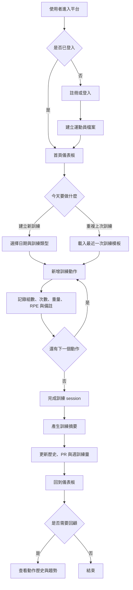

# 訓練記錄 MVP 規格

狀態：草案

最後更新：2026-05-22

## 使用者問題

使用者需要快速記錄訓練內容，並在訓練後理解近期進步、訓練量與需要注意的變化。記錄流程不能太慢，否則使用者會在訓練中放棄輸入。

## 目標使用者

- 個人訓練者：追蹤力量、訓練量與穩定性。
- 回訪使用者：想沿用上次訓練內容快速建立今天的訓練。
- 教練或準教練使用者：需要未來能檢視學員摘要，但 MVP 先以個人流程為主。

## 核心流程

- 建立或重複一份訓練。
- 新增訓練動作。
- 記錄每組的次數、重量、RPE、休息與備註。
- 完成訓練 session。
- 查看 dashboard 摘要、PR、週訓練量與動作歷史。

## 非目標

- MVP 不包含完整教練端管理。
- MVP 不包含付款、訂閱與組織管理。
- MVP 不讓 AI 自動決定訓練計畫；若加入 AI，先以摘要與異常提示為主。

## 驗收條件

- 使用者可以建立新的訓練 session。
- 使用者可以從最近一次訓練建立重複 session。
- 使用者可以新增動作與 set 紀錄。
- 使用者可以將 session 標記為完成。
- Dashboard 可以顯示 7 天摘要、總組數、總訓練量與 PR。
- 動作歷史可以顯示指定動作在 12 週內的趨勢。
- API 錯誤格式一致，validation error 能指出欄位問題。

## 資料模型

| 實體 | 主要欄位 | 說明 |
| --- | --- | --- |
| User | `id`, `email`, `displayName` | 登入使用者。 |
| AthleteProfile | `id`, `userId`, `unitSystem`, `trainingGoal`, `experienceLevel`, `bodyWeightKg` | 使用者訓練設定與基本資料。 |
| Exercise | `id`, `name`, `primaryMuscleGroup`, `equipment`, `isCustom`, `notes` | 系統或自訂訓練動作。 |
| WorkoutSession | `id`, `userId`, `performedAt`, `title`, `status`, `notes`, `sourceWorkoutSessionId` | 一次訓練。 |
| WorkoutEntry | `id`, `workoutSessionId`, `exerciseId`, `order` | Session 中的一個動作。 |
| SetEntry | `id`, `workoutEntryId`, `setNumber`, `reps`, `loadKg`, `rpe`, `restSeconds`, `notes` | 單組紀錄。 |
| PersonalRecord | `id`, `userId`, `exerciseId`, `type`, `valueKg`, `achievedAt` | 個人紀錄。 |

## UX 狀態

- 空狀態：使用者尚未有訓練時，提供建立新訓練入口。
- 草稿狀態：session 尚未完成時可繼續編輯。
- 完成狀態：session 完成後更新摘要與歷史。
- 載入狀態：dashboard、動作搜尋、歷史圖表需有 loading state。
- 錯誤狀態：API validation 或儲存失敗時顯示可理解訊息。
- 回訪狀態：有歷史訓練時，首頁提供重複最近訓練入口。

## 流程圖



## API I/O 草案

API I/O 先以 REST JSON 表示，方便 MVP 實作與測試。實際路由可在建立後端時依框架慣例調整，但欄位語意應維持一致。

### 使用者與運動員檔案

`GET /api/me`

Response：

```json
{
  "user": {
    "id": "usr_123",
    "email": "user@example.com",
    "displayName": "Wei"
  },
  "athleteProfile": {
    "id": "ath_123",
    "unitSystem": "metric",
    "trainingGoal": "strength",
    "experienceLevel": "intermediate"
  }
}
```

`PUT /api/me/athlete-profile`

Request：

```json
{
  "unitSystem": "metric",
  "trainingGoal": "strength",
  "experienceLevel": "intermediate",
  "bodyWeightKg": 74.5
}
```

Response：

```json
{
  "athleteProfile": {
    "id": "ath_123",
    "unitSystem": "metric",
    "trainingGoal": "strength",
    "experienceLevel": "intermediate",
    "bodyWeightKg": 74.5,
    "updatedAt": "2026-05-22T09:00:00.000Z"
  }
}
```

### 訓練動作

`GET /api/exercises?query=squat`

Response：

```json
{
  "exercises": [
    {
      "id": "ex_001",
      "name": "Back Squat",
      "primaryMuscleGroup": "legs",
      "equipment": "barbell",
      "isCustom": false
    }
  ]
}
```

`POST /api/exercises`

Request：

```json
{
  "name": "Paused Bench Press",
  "primaryMuscleGroup": "chest",
  "equipment": "barbell",
  "notes": "Pause one second on chest."
}
```

Response：

```json
{
  "exercise": {
    "id": "ex_custom_123",
    "name": "Paused Bench Press",
    "primaryMuscleGroup": "chest",
    "equipment": "barbell",
    "isCustom": true,
    "createdAt": "2026-05-22T09:00:00.000Z"
  }
}
```

### 訓練 Session

`POST /api/workout-sessions`

Request：

```json
{
  "performedAt": "2026-05-22T18:30:00.000Z",
  "title": "Lower Body Strength",
  "source": "new",
  "notes": "Energy felt good."
}
```

Response：

```json
{
  "workoutSession": {
    "id": "ws_123",
    "performedAt": "2026-05-22T18:30:00.000Z",
    "title": "Lower Body Strength",
    "status": "draft",
    "notes": "Energy felt good."
  }
}
```

`POST /api/workout-sessions/repeat`

Request：

```json
{
  "sourceWorkoutSessionId": "ws_122",
  "performedAt": "2026-05-22T18:30:00.000Z",
  "copyWeights": true,
  "copyNotes": false
}
```

Response：

```json
{
  "workoutSession": {
    "id": "ws_123",
    "sourceWorkoutSessionId": "ws_122",
    "performedAt": "2026-05-22T18:30:00.000Z",
    "status": "draft",
    "exerciseCount": 5,
    "setCount": 18
  }
}
```

`GET /api/workout-sessions/:id`

Response：

```json
{
  "workoutSession": {
    "id": "ws_123",
    "performedAt": "2026-05-22T18:30:00.000Z",
    "title": "Lower Body Strength",
    "status": "completed",
    "notes": "Energy felt good.",
    "entries": [
      {
        "id": "we_001",
        "exercise": {
          "id": "ex_001",
          "name": "Back Squat"
        },
        "sets": [
          {
            "id": "set_001",
            "setNumber": 1,
            "reps": 5,
            "loadKg": 100,
            "rpe": 7.5,
            "restSeconds": 180,
            "notes": ""
          }
        ]
      }
    ]
  }
}
```

`PATCH /api/workout-sessions/:id`

Request：

```json
{
  "title": "Lower Body Strength",
  "status": "completed",
  "notes": "Top set moved well."
}
```

Response：

```json
{
  "workoutSession": {
    "id": "ws_123",
    "title": "Lower Body Strength",
    "status": "completed",
    "notes": "Top set moved well.",
    "updatedAt": "2026-05-22T10:30:00.000Z"
  }
}
```

### 訓練紀錄項目與組數

`POST /api/workout-sessions/:id/entries`

Request：

```json
{
  "exerciseId": "ex_001",
  "order": 1
}
```

Response：

```json
{
  "entry": {
    "id": "we_001",
    "workoutSessionId": "ws_123",
    "exerciseId": "ex_001",
    "order": 1
  }
}
```

`POST /api/workout-entries/:id/sets`

Request：

```json
{
  "setNumber": 1,
  "reps": 5,
  "loadKg": 100,
  "rpe": 7.5,
  "restSeconds": 180,
  "notes": ""
}
```

Response：

```json
{
  "set": {
    "id": "set_001",
    "workoutEntryId": "we_001",
    "setNumber": 1,
    "reps": 5,
    "loadKg": 100,
    "rpe": 7.5,
    "estimatedOneRepMaxKg": 116.7,
    "restSeconds": 180,
    "notes": ""
  }
}
```

`PATCH /api/sets/:id`

Request：

```json
{
  "reps": 6,
  "loadKg": 100,
  "rpe": 8
}
```

Response：

```json
{
  "set": {
    "id": "set_001",
    "reps": 6,
    "loadKg": 100,
    "rpe": 8,
    "estimatedOneRepMaxKg": 120,
    "updatedAt": "2026-05-22T10:35:00.000Z"
  }
}
```

### 歷史與摘要

`GET /api/history/exercises/:exerciseId?range=12w`

Response：

```json
{
  "exercise": {
    "id": "ex_001",
    "name": "Back Squat"
  },
  "range": "12w",
  "summary": {
    "bestEstimatedOneRepMaxKg": 125,
    "totalSets": 72,
    "totalVolumeKg": 38400,
    "lastPerformedAt": "2026-05-22T18:30:00.000Z"
  },
  "series": [
    {
      "performedAt": "2026-05-22T18:30:00.000Z",
      "topSet": {
        "reps": 5,
        "loadKg": 105,
        "rpe": 8
      },
      "volumeKg": 4200,
      "estimatedOneRepMaxKg": 122.5
    }
  ]
}
```

`GET /api/dashboard/summary?range=7d`

Response：

```json
{
  "range": "7d",
  "completedWorkoutCount": 4,
  "totalSets": 68,
  "totalVolumeKg": 28400,
  "personalRecords": [
    {
      "exerciseId": "ex_001",
      "exerciseName": "Back Squat",
      "type": "estimated_one_rep_max",
      "valueKg": 125,
      "achievedAt": "2026-05-22T18:30:00.000Z"
    }
  ],
  "attentionItems": [
    {
      "type": "missed_session",
      "message": "本週少完成 1 次下肢訓練。"
    }
  ]
}
```

### API 錯誤格式

所有 API 錯誤應回傳一致格式：

```json
{
  "error": {
    "code": "VALIDATION_ERROR",
    "message": "輸入資料不完整。",
    "fields": {
      "reps": "次數必須大於 0。"
    }
  }
}
```

## 可靠性與隱私注意事項

- API 必須驗證數值範圍，例如 `reps > 0`、`loadKg >= 0`、`rpe` 介於 1 到 10。
- 使用者只能讀寫自己的訓練資料。
- 不要在 logs 中記錄私人訓練備註、email 以外的個資或 auth token。
- 任何摘要或 PR 更新都應可由原始 set 資料重新計算。
- Session 完成後仍可編輯，但應更新 `updatedAt` 並重新計算摘要。
